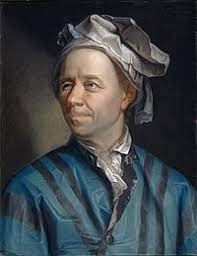

# Discretely-Indexed-Flows



## models_dif Librabry

### Installation 

In order to install... 

```shell
pip install git+https:... 
```

```python
import models_dif
```

````python
import torch 
model = models_dif.DIFDensityEstimator(target_samples = torch.randn(1000,1), K=5)
model.train(epochs = 20)
````

## DIF Github Project 

To clone the project
```shell
git clone https:....
cd Discretely-Indexed-Flows
pip install -r requirements.txt
```
3 examples notebook