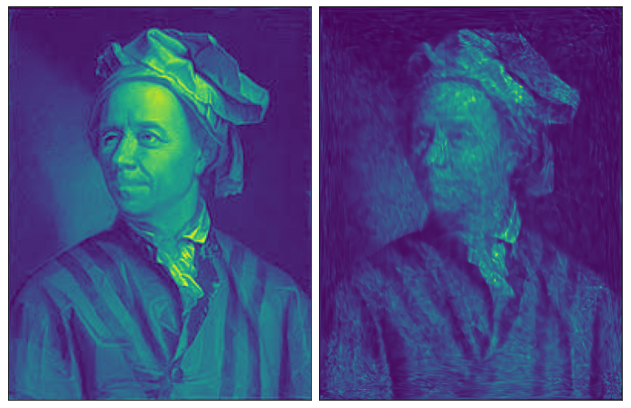

# Discretely-Indexed-Flows



## models_dif Library

### Installation 

In order to install the package: 

```shell
pip install git+https://github.com/ElouanARGOUARCH/Discretely-Indexed-Flows.git
```

```python
import models_dif
```

This package includes DIFDensityEstimator which performs density estimation from samples can be used with

````python
import torch 
p = 1
model = models_dif.DIFDensityEstimator(target_samples = torch.randn(100,p), K=5)
model.train(epochs = 20, batch_size= 200)
model_samples = model.sample_model(num_samples = 100)
model_log_density = model.log_density(torch.randn(1000,p))
````
It also includes DIFSampler which performs Variational Inference from an unormalized density function
````python
import torch 
p = 1 
model = models_dif.DIFSample(target_log_density = lambda samples: torch.distributions.MultivariateNormal(torch.zeros(p), torch.eye(p)).log_prob(samples),p=p,K=5)
model.train(epochs = 20, num_samples= 5000, batch_size= 200)
model_samples = model.sample_model(num_samples = 100)
model_log_density = model.log_density(torch.randn(1000,p))
````

## DIF Github Project 

To clone the project and access more elaborate usage examples: 
```shell
git clone https://github.com/ElouanARGOUARCH/Discretely-Indexed-Flows.git
cd Discretely-Indexed-Flows
pip install -r requirements.txt
```

In particular, there are several notebook which include more elaborate examples, as well as figures displayed in the paper. 
